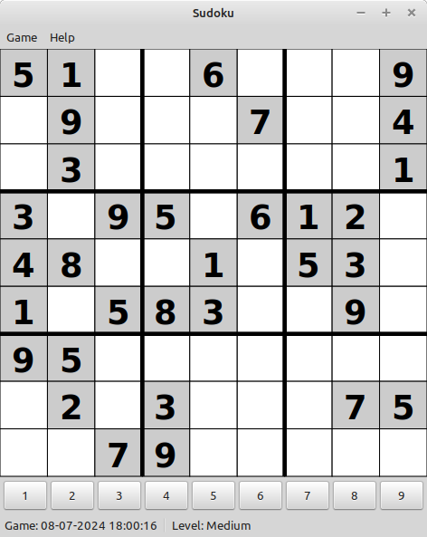
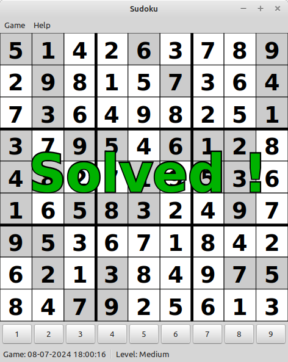
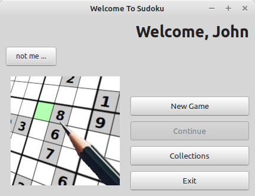
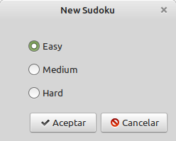
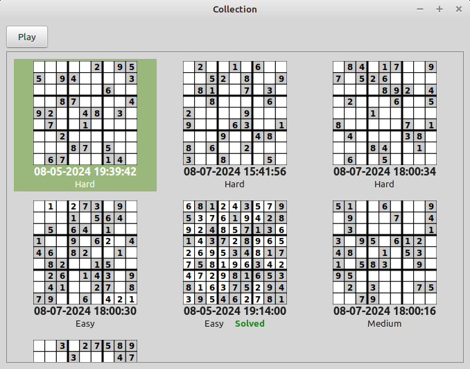

# Sudoku GTK+ 3.0 Version
A C++ Sudoku game using GTK+ 3.0.

---

## Screenshots

### Main Window

*The main interface of the Sudoku game.*

### Solved Sudoku

*An example of a solved Sudoku puzzle.*

---

## Welcome Window

### Welcome Screen

*The initial welcome screen of the game.*

### Level Selection

*Interface for selecting the difficulty level.*

### Collection

*Sudoku puzzles are stored in a collection, allowing you to replay them.*
