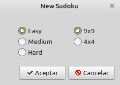
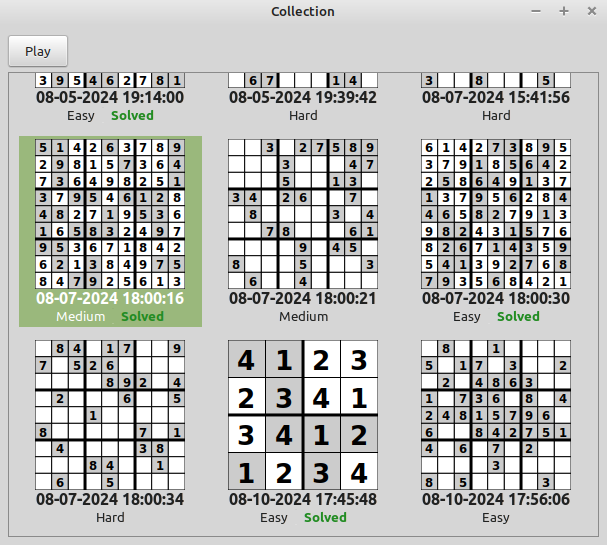

# Sudoku GTK+ 3.0 Version
A C++ Sudoku game using GTK+ 3.0.

---

## Screenshots

### Main Window

*The main interface of the Sudoku game.*

### Solved Sudoku

*An example of a solved Sudoku puzzle.*

---

## Welcome Window

### Welcome Screen

*The initial welcome screen of the game.*

### Level Selection

*Interface for selecting the difficulty level.*

### Collection

*Sudoku puzzles are stored in a collection, allowing you to replay them.*

---

## Features
- **User-Friendly Interface**: Clean and intuitive design.
- **Multiple Difficulty Levels**: Choose from various levels of difficulty.
- **Puzzle Collection for Each Player**: Collections are stored separately for each player.
- **Change Player Name**: Easily switch between different players by changing the player name.
- **Reset and Replay Puzzles**: Replay solved Sudoku puzzles using the reset option.
- **Resizable Board**: The board resizes with the window while maintaining the aspect ratio.
- **Automatic Saving**: The game automatically saves your progress.

---

## Installation
To install and run the Sudoku game:

1. **Clone the repository**:
    ```bash
    git clone https://github.com/codigoymate/gtk-sudoku
    ```
2. **Navigate to the directory**:
    ```bash
    cd gtk-sudoku
    ```
3. **Build the project**:
    ```bash
    mkdir build
	cd build
	cmake ..
	make
    ```
4. **Install**:
    ```bash
	sudo make install
    ```

5. **Run the game**:
    ```bash
	sudoku
    ```

---

## Usage
- **Start a new game**: Select a difficulty level and begin solving.
- **Change player**: Switch to a different player clicking "not me ..".
- **Reset a solved puzzle**: Replay a solved puzzle by selecting the reset option.
- **View collection**: Access previously solved and unsolved puzzles from the collection, specific to each player.

---

## Contributing
Contributions are welcome! Please fork this repository and submit a pull request with your improvements or bug fixes.

---

## License
This project is licensed under the MIT License. See the [LICENSE](./LICENSE) file for more details.

---
